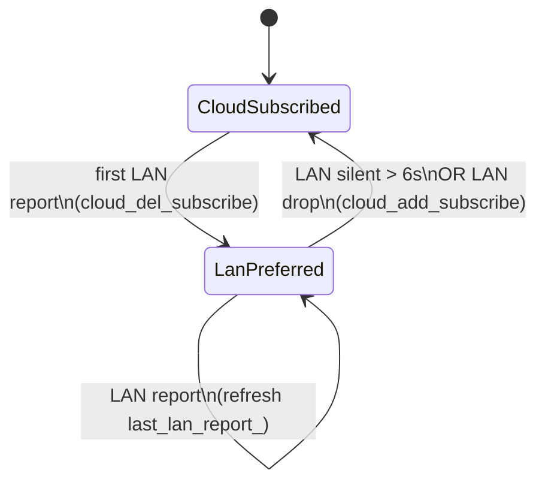

# STATUS — ABI coverage of `open-bamboo-networking`

This document tracks how each symbol listed in [research § 8](research/08-abi-main.md#8-the-main-module-abi-contract) is handled by this open-source plugin. Top-level `##` headings group related surfaces; **subsection numbers (`### 8._n_`) match the same §8._n_ titles in the reference** so you can jump between the two documents. Everything that talks to Bambu’s cloud over **HTTPS** (and the closely related **cloud MQTT** session in §8.3) is rolled into one block, **Cloud & HTTP APIs**, with subsections below it.

## Legend

| Mark | Meaning |
| :--: | --- |
| ✅ | Implemented the same way as the stock plugin (behavioural parity with the symbols Studio calls). |
| ❌ | Not implemented. Either returns a hard error or silently answers with an empty payload so Studio's UI degrades gracefully. The exact mode is noted per row. |
| 🔒 | Cannot be implemented without proprietary secrets (per-install RSA signing keys, TUTK / Agora SDK). |
| ⚠️ | Implemented with limitations — the happy path works, but some user-visible behaviour is degraded vs. stock. |
| 🔒⚠️ | Partial: the secret-protected path is not possible, but the remaining path (typically LAN under Developer Mode) is functional. |
| ✨ | Implemented via an alternative path — end result matches stock behaviour on the **supported subset** but over a different transport or by synthesising the response locally. Known gaps vs stock are called out in the Notes column (see [PrinterFileSystem](#printerfilesystem-mediafilepanel) for internal storage). |
| ❓ | Exported for binary compatibility but not currently resolved by Bambu Studio, so behaviour against real Studio code cannot be verified. Body is a minimal stub. |

> Note on `❌`: some of these return `BAMBU_NETWORK_SUCCESS` with an empty payload rather than an error code. This is intentional — the corresponding feature is not wired to any remote backend, and returning success with empty data is what keeps Studio from showing error dialogs for features that are simply unused in this plugin. The "what is actually returned" is stated per row in the Notes column.

---

## Supported slicers

The same plugin binary works under both **Bambu Studio** and **Orca Slicer** — they consume the same C ABI documented below. The build system handles client-specific install conventions via `./configure --client-type=bambu_studio | orca_slicer` (Studio is the default). Per-client differences:

| Aspect | Bambu Studio | Orca Slicer |
| --- | --- | --- |
| Default install prefix (Linux) | `~/.config/BambuStudio` | `~/.config/OrcaSlicer` (or the Flatpak config dir if it exists) |
| Default install prefix (Windows) | `%APPDATA%\BambuStudio\plugins\` | `%APPDATA%\OrcaSlicer\plugins\` |
| Linux `.so` file name on disk | `libbambu_networking.so` (fixed) | `libbambu_networking_<network_plugin_version>.so` |
| Windows DLL file name on disk | `bambu_networking.dll` (fixed) | `bambu_networking_<network_plugin_version>.dll` |
| `network_plugins.json` OTA manifest | Installed under `ota/plugins/`; Studio reads it as a persistent manifest | Not installed — Orca only writes it as a transient OTA artefact |
| Conf-file patch (`make install`) | `BambuStudio.conf`: `installed_networking="1"`, `update_network_plugin="false"` | `OrcaSlicer.conf`: `installed_networking="true"`, `network_plugin_version="<OBN_VERSION>"`, `network_plugin_remind_later="true"`, `<OBN_VERSION>` stripped from `network_plugin_skipped_versions` |
| Windows camera back-end | Direct C ABI (`Bambu_*`) consumed by the new `wxMediaCtrl3` (FFmpeg in-tree). No DirectShow filter required. | Legacy `wxMediaCtrl2` over the Windows Media Player / DirectShow path. Camera live view goes through our **`BambuSource.dll`** registered as a DirectShow Source Filter (CLSID `{233E64FB-2041-4A6C-AFAB-FF9BCF83E7AA}`). |

See [BUILDING — Manual installation](BUILDING.md#manual-installation) for the full setup story.

---

## 8.1. Initialization

Source: [src/abi_meta.cpp](src/abi_meta.cpp), [src/abi_lifecycle.cpp](src/abi_lifecycle.cpp).

| Function | Status | Notes |
| --- | :--: | --- |
| `bambu_network_check_debug_consistent` | ✅ | Always returns `true`. A single release-mode `.so` is expected to satisfy both Studio build flavours. |
| `bambu_network_get_version` | ✅ | Returns `OBN_VERSION_STRING`, auto-detected at configure time from `<prefix>/BambuStudio.conf` (or `--with-version=…`). First 8 characters are kept in sync with shipped `SLIC3R_VERSION` to pass the compatibility gate. |
| `bambu_network_create_agent` | ✅ | Allocates the internal agent and bootstraps logging from the supplied `log_dir`. |
| `bambu_network_destroy_agent` | ✅ | Deletes the agent instance. |
| `bambu_network_init_log` | ✅ | No-op here: log sinks are configured inside `create_agent`, before the first log line. |
| `bambu_network_set_config_dir` | ✅ | Stored on the agent; used for auth cache, device-cert snapshots, and `<config_dir>/obn.env` (IPC to `libBambuSource`). Also publishes `OBN_CONFIG_DIR` in the process environment. |
| `bambu_network_set_cert_file` | ✅ | Studio passes `resources/cert/` + `slicer_base64.cer` (ABI). LAN uses **`printer.cer`** from that folder (synced to env + `obn.env` as `OBN_LAN_TLS_CA_FILE`); **`slicer_base64.cer`** is stored for Windows cloud MQTT only (see [research §10.6](research/10.06-lan-tls-and-access-codes.md)). |
| `bambu_network_set_country_code` | ✅ | Stored; drives cloud region selection (`api_host`, `web_host`). |
| `bambu_network_start` | ✅ | Starts worker threads. If a cached session is present the plugin also kicks off `connect_cloud()` here — the stock call chain normally goes through `EVT_USER_LOGIN_HANDLE`, but that cascade can silently stall for cached sign-ins; starting from `start()` guarantees cloud MQTT gets initiated. |

---

## 8.2. Callbacks (registration)

Source: [src/abi_callbacks.cpp](src/abi_callbacks.cpp). All entries are thin `std::function` setters stored on the agent.

| Function | Status | Notes |
| --- | :--: | --- |
| `bambu_network_set_on_ssdp_msg_fn` | ✅ | Fired on each SSDP `NOTIFY`. |
| `bambu_network_set_on_user_login_fn` | ✅ | Fired on sign-in / sign-out transitions. |
| `bambu_network_set_on_printer_connected_fn` | ✅ | Fired when the LAN MQTT broker accepts a connection. |
| `bambu_network_set_on_server_connected_fn` | ✅ | Fired when the cloud MQTT broker accepts a connection. |
| `bambu_network_set_on_http_error_fn` | ✅ | Fired on non-2xx cloud REST from bind stack (`ping_bind` / `bind` / `unbind` / `query_bind_status` / ticket helpers); body clipped to 1024. |
| `bambu_network_set_get_country_code_fn` | ✅ | Pulled by the agent whenever a cloud request needs the current region. |
| `bambu_network_set_on_subscribe_failure_fn` | ✅ | Fired when an MQTT topic subscription is rejected. |
| `bambu_network_set_on_message_fn` | ✅ | Cloud-side push frames. |
| `bambu_network_set_on_user_message_fn` | ✅ | Cloud-side user-channel frames. |
| `bambu_network_set_on_local_connect_fn` | ✅ | LAN MQTT session state. |
| `bambu_network_set_on_local_message_fn` | ✅ | LAN-side push frames. |
| `bambu_network_set_queue_on_main_fn` | ✅ | Used for every wxWidgets-touching callback dispatch. |
| `bambu_network_set_server_callback` | ✅ | Generic cloud error channel. |

---

## Cloud & HTTP APIs

Subsections use the same **§8._n_** numbers as [research § 8](research/08-abi-main.md#8-the-main-module-abi-contract). **§8.3** is cloud **MQTT** (TLS to the broker), not REST on `api.bambulab.*`, but it shares the same logged-in session, region, and callback wiring as the HTTPS calls below.

### 8.3. Cloud — connection and subscriptions

Source: [src/abi_cloud.cpp](src/abi_cloud.cpp).

| Function | Status | Notes |
| --- | :--: | --- |
| `bambu_network_connect_server` | ✅ | Opens cloud MQTT over TLS using the cached user session. |
| `bambu_network_is_server_connected` | ✅ | Reports the current cloud MQTT session state. |
| `bambu_network_refresh_connection` | ✅ | Called on Studio's ~1 Hz device-refresh tick; delegates to the agent which decides whether a reconnect is actually needed. |
| `bambu_network_start_subscribe` | ✅ | No-op, matching stock semantics: the "module" argument is a keepalive hint rather than an MQTT topic, and stock does not map it to an explicit subscription either. |
| `bambu_network_stop_subscribe` | ✅ | Same as above. |
| `bambu_network_add_subscribe` | ✅ | Buffers the requested device set; applies on current or next `CONNACK`. |
| `bambu_network_del_subscribe` | ✅ | Unsubscribes individual `device/<id>/report` topics. |
| `bambu_network_enable_multi_machine` | ✅ | No-op: multi-machine mode only toggles Studio's UI; there is no plugin-side state tied to it. |
| `bambu_network_send_message` | ✅ | LAN-first routing: tries the LAN MQTT session for the target `dev_id`; falls back to cloud MQTT when no LAN session matches. |

#### LAN-priority report subscription (defer-close + failback)

Stock Studio's `DeviceSubscribeManager` prefers LAN telemetry and leaves the cloud `device/<id>/report` topic unsubscribed while LAN is alive (see [research §6.2](research/06.02-mqtt.md)). Since our plugin keeps both MQTT sessions up, it reproduces that policy itself rather than double-delivering reports over both transports. The FSM lives in [src/agent.cpp](src/agent.cpp):

- **Prefer LAN on first local report.** `maybe_prefer_lan_subscription(dev_id)` (called from `notify_local_message`) records `last_lan_report_[dev_id]` and, on the *first* LAN report for a device, inserts it into `lan_report_priority_` and issues `cloud_del_subscribe({dev_id})` — a **defer-close** of the cloud report leg (the cloud MQTT socket stays connected, just unsubscribed from that device's reports). It also starts the watchdog.
- **Silence watchdog.** `lan_watchdog_loop()` wakes every `kLanWatchdogTick` (2 s); if a device in `lan_report_priority_` has produced no LAN report for longer than `kLanSilenceFailback` (6 s) it triggers failback.
- **Failback to cloud.** `lan_report_failback(dev_id)` removes the device from `lan_report_priority_` and calls `cloud_add_subscribe({dev_id})`. It also fires immediately (not just on watchdog timeout) from `notify_local_connected` when the LAN session drops with a non-OK status.
- **Reconcile with the implicit subscribe.** `cloud_add_subscribe` filters out any device currently in `lan_report_priority_`, so the implicit subscribe that `get_user_print_info` performs cannot re-open a cloud report subscription the FSM intends to keep deferred.

**`block_cloud` audit.** When `block_cloud` is set, `add_subscribe` / `del_subscribe` / `connect_server` short-circuit to `SUCCESS` without ever creating a cloud subscription ([src/abi_cloud.cpp](src/abi_cloud.cpp)), and `get_user_print_info` skips its implicit `cloud_add_subscribe` ([src/abi_http.cpp](src/abi_http.cpp)). So the plugin never opens a cloud subscription it then fails to tear down; under `block_cloud` the printer must be reachable over LAN for status to flow, which is the intended trade-off.

### 8.5. Authentication and user

Source: [src/abi_user.cpp](src/abi_user.cpp).

| Function | Status | Notes |
| --- | :--: | --- |
| `bambu_network_change_user` | ✅ | Empty / `{}` are no-ops (session unchanged). Non-empty user_info parses the login envelope and applies it. Logout is `user_logout` only. |
| `bambu_network_is_user_login` | ✅ | Polled on every sidebar repaint; returns the current session state. |
| `bambu_network_user_logout` | ✅ | Clears the agent session. When `request=true`, also `POST /v1/user-service/my/logout` (Bearer + `{"refreshtoken":""}`) before the local clear. |
| `bambu_network_get_user_id` | ✅ | Returned from the agent's session snapshot. |
| `bambu_network_get_user_name` | ✅ | Returned from the agent's session snapshot. |
| `bambu_network_get_user_avatar` | ✅ | Returned from the agent's session snapshot. |
| `bambu_network_get_user_nickanme` | ✅ | The stock typo is preserved on purpose — Studio resolves the symbol by that exact name. Falls back to `user_name` when `nick_name` is empty. |
| `bambu_network_build_login_cmd` | ✅ | Emits the stock-shape `{"command":"studio_userlogin", …}` envelope the Studio WebViews listen for. |
| `bambu_network_build_logout_cmd` | ✅ | Emits the mirror envelope `{"command":"studio_useroffline", …}`. |
| `bambu_network_build_login_info` | ✅ | Reuses the `userlogin` envelope; that is what `WebViewPanel::SendLoginInfo` forwards to the currently visible WebView. |
| `bambu_network_get_my_profile` | ✅ | Issues the cloud `GET /v1/user-service/my/profile` call. Note Studio's known bug: this symbol is also resolved under the name `get_my_token_ptr`, so both paths must share an identical signature — which they do. |
| `bambu_network_get_my_token` | ✅ | Exchanges a browser-login ticket for an access token (`POST /user-service/user/ticket/<T>`). |
| `bambu_network_get_user_info` | ✅ | Returns the numeric user id. Uses `stoll` + narrowing cast because cloud user ids are 32-bit unsigned and would overflow `std::stoi`. |

### 8.6. Binding / bind

Source: [src/abi_bind.cpp](src/abi_bind.cpp).

| Function | Status | Notes |
| --- | :--: | --- |
| `bambu_network_ping_bind` | ✅ | Wire-aligned: `POST /v1/user-service/my/pincode/<PIN>` body `{"pincode":"<PIN>"}`. |
| `bambu_network_bind_detect` | ✅ | Wire-aligned: plaintext TCP `dev_ip:3000`, frame `A5 A5 \| u16le \| JSON \| A7 A7`, `login.command=detect` → `detectResult` fields. |
| `bambu_network_bind` | ✅ | Wire-aligned account bind: TCP `:3000` `login` (+ timezone / `e-improved`) → `wait_auth` ticket → `GET`+`POST /v1/user-service/my/ticket/<T>` `source:device`; stages via `OnUpdateStatusFn`. |
| `bambu_network_unbind` | ✅ | Wire-aligned: `DELETE /v1/iot-service/api/user/bind` with JSON body `{"dev_id","force":false}`. |
| `bambu_network_request_bind_ticket` | ✅ | WebView SSO ticket: `GET /user-service/user/ticket` then **`POST /user-service/my/ticket/<T>`** to bind the code to the session (required — mint alone leaves MakerWorld with an empty `token` cookie / sign-in page). Used for Print History detail, MakerWorld, bind WebViews. |
| `bambu_network_query_bind_status` | ✅ | Wire-aligned: `GET /v1/iot-service/api/user/bind_list?dev_ids=…`; forwards raw `http_code`/`http_body` (incl. non-2xx via `on_http_error`). |
| `bambu_network_report_consent` | ❌ | Intentional no-op (`SUCCESS`). Studio **does** call this when logged in ([`ba049f6a2`](https://github.com/bambulab/BambuStudio/commit/ba049f6a2e08c3b6033660bb84da80c08722974b): privacy / improvement policy / Helio TOU) with body for `POST /v1/user-service/user/consent`; return value ignored; local dialogs still persist via `app_config`. Not implemented: privacy-preserving (no consent telemetry to Bambu); logged-out Studio already POSTs itself. See `research/08.10-http.md`. |

### 8.7. Printer selection and metadata

Sources: [src/abi_user.cpp](src/abi_user.cpp), [src/abi_bind.cpp](src/abi_bind.cpp), [src/abi_http.cpp](src/abi_http.cpp).

| Function | Status | Notes |
| --- | :--: | --- |
| `bambu_network_get_bambulab_host` | ✅ | Returns the region-appropriate portal host (ends with `/`, as stock does). |
| `bambu_network_get_user_selected_machine` | ✅ | Agent-side selection state, hydrated from `obn.state.json` at startup so the Device tab comes back selected — the slicers clear their own copy of the id before the printer list exists ([#78](https://github.com/ClusterM/open-bambu-networking/issues/78), [§8.7](research/08.07-printer-selection.md)). |
| `bambu_network_set_user_selected_machine` | ✅ | Agent-side selection state; non-empty ids are persisted. Deselection is kept in memory only, because the slicers deselect on logout, on agent swap and on any refresh tick that finds the printer missing. |
| `bambu_network_modify_printer_name` | ✅ | Cloud rename call. |
| `bambu_network_get_printer_firmware` | ✨ | Stock calls Bambu's cloud firmware catalogue. This plugin re-synthesises the JSON envelope locally from the MQTT frames the printer already sends (`info.command=get_version` replies and `push_status.upgrade_state.new_ver_list`). That populates the Update panel and lights up the "update available" badge without any cloud roundtrip. The "Update" button itself is a plain LAN MQTT passthrough; the printer fetches the binary from Bambu's CDN directly. Trade-off: no cross-version history — only the advertised version is flashable. |

### 8.9. User presets

Source: [src/abi_presets.cpp](src/abi_presets.cpp), [src/cloud_presets.cpp](src/cloud_presets.cpp). Full CRUD against Bambu's `api.bambulab.com/v1/iot-service/api/slicer/setting` endpoint, using only the user's bearer token (the stock `X-BBL-*` fingerprint headers aren't required by the server).

This implementation goes a step beyond the stock plugin. Studio's original `bambu_networking.so` only retrieves metadata (`setting_id`, `name`, `update_time`, …) from `GET /setting`, assuming the actual preset bodies are present on disk — so wiping the local preset directory permanently loses cloud-stored configs on that machine. We additionally call `GET /setting/<id>` for every preset Studio's `CheckFn` asks us to sync, and feed the full flattened config into `get_user_presets()` so true cross-device sync works even on a fresh install.

| Function | Status | Notes |
| --- | :--: | --- |
| `bambu_network_get_user_presets` | ✅ | Drains the cache populated by the preceding `get_setting_list2` call into Studio's `map<name, values_map>`. |
| `bambu_network_request_setting_id` | ✅ | `POST /slicer/setting` with `{name, type, version, base_id, filament_id, setting:{…}}`. Returns the new `PPUS/PFUS/PMUS` id, refreshes `values_map["updated_time"]`, and surfaces server `code` (e.g. `"14"` = preset limit) into `values_map["code"]` so Studio's limit handling keeps working. |
| `bambu_network_put_setting` | ✅ | `PATCH /slicer/setting/<id>` with the same body shape as create. Refreshes `values_map["updated_time"]`. |
| `bambu_network_get_setting_list` | ✅ | Full sync (no filter): lists all user presets, downloads every body, caches for `get_user_presets`. |
| `bambu_network_get_setting_list2` | ✨ | Stock plugin only lists metadata and relies on local files. We additionally `GET /slicer/setting/<id>` for presets the Studio-provided `CheckFn` flags as needed, so cross-device sync actually delivers the content. |
| `bambu_network_delete_setting` | ✅ | `DELETE /slicer/setting/<id>`; server-side idempotent (missing id still returns 200). |

### 8.10. HTTP / service

Source: [src/abi_http.cpp](src/abi_http.cpp).

| Function | Status | Notes |
| --- | :--: | --- |
| `bambu_network_get_studio_info_url` | ❌ | Returns empty string. **No GUI call site in [BambuStudio `ba049f6a2`](https://github.com/bambulab/BambuStudio/commit/ba049f6a2e08c3b6033660bb84da80c08722974b)** (legacy `GUI_App` / `PresetUpdater` only; still `dlsym`'d). Stock returns `https://api.bambulab.com/v1/iot-service/api/slicer/resource` (no HTTP). Probe: `plugin_runner --action http_probe`. |
| `bambu_network_set_extra_http_header` | ✅ | Stored on the agent and applied to every outbound HTTPS request. |
| `bambu_network_get_my_message` | ❌ | Empty body / success. **No GUI call site in [BambuStudio `ba049f6a2`](https://github.com/bambulab/BambuStudio/commit/ba049f6a2e08c3b6033660bb84da80c08722974b).** Stock: `GET /v1/user-service/my/messages/type=&after=&limit=` (404 on prod in probe — path uses `/` not `?`). |
| `bambu_network_check_user_task_report` | ❌ | `task_id=0, printable=false`. **No GUI call site in [BambuStudio `ba049f6a2`](https://github.com/bambulab/BambuStudio/commit/ba049f6a2e08c3b6033660bb84da80c08722974b).** Stock probe: no dedicated HTTPS when idle; returned `task_id=-1`, `printable=true`. |
| `bambu_network_get_user_print_info` | ✅ | Fetches `GET /v1/iot-service/api/user/print?force=true` **first** (`src/abi_http.cpp`), which already returns Studio-native field names (`dev_name`, `dev_online`, `dev_access_code`) so no remap is needed; falls back to `GET /v1/iot-service/api/user/bind` (with the `name`→`dev_name` / `online`→`dev_online` / `print_status`→`task_status` remap) only when `/user/print` yields nothing. Implicitly subscribes to `device/<id>/report` for each returned device (matching stock push-delivery behaviour), skipping the subscribe when `block_cloud` is set. Cross-validated in [issue #49](https://github.com/ClusterM/open-bambu-networking/issues/49). |
| `bambu_network_get_user_tasks` | ✅ | `GET /v1/user-service/my/tasks?limit=&offset=&status=[&deviceId=]` — response `{total,hits:[…]}` forwarded verbatim to Studio's TaskManager / Print History WebView. Confirmed against MITM of stock `02.08.01.51`. Empty envelope under `block_cloud` or `cloud_hide_history=1`. |
| `bambu_network_get_task_plate_index` | ❌ | `plate_index=-1`. **No GUI call site in [BambuStudio `ba049f6a2`](https://github.com/bambulab/BambuStudio/commit/ba049f6a2e08c3b6033660bb84da80c08722974b)** (legacy `update_slice_info`). Stock: same `GET …/user/task/<id>` as `get_subtask_info`, returns plate from `content.info.plate_idx`. |
| `bambu_network_get_subtask_info` | ✅ | **Cloud id:** `GET /v1/iot-service/api/user/task/<id>` (Bearer), body forwarded verbatim — Studio reads `context.plates[].thumbnail.url` (+ `prediction`/`weight`/`filaments`). Runs even under `block_cloud`. **LAN zero ids:** synthetic `lan-<fnv>` → loopback cover via `cover_cache` **SUB_FILE on :6000**. Confirmed MITM stock `02.08.01.53`. |
| `bambu_network_get_slice_info` | ❌ | Empty body. **No GUI call site in [BambuStudio `ba049f6a2`](https://github.com/bambulab/BambuStudio/commit/ba049f6a2e08c3b6033660bb84da80c08722974b)** (replaced by `get_subtask_info`). Stock: `GET …/user/project/<project_id>?profile_id=` — needs a real project id; empty/`model_id` probes 405/422. |
| `bambu_network_post_device_region` | ✅ | Gated on `ABI_VERSION >= 0x020804`. `POST /v1/user-service/device/region` with `{"ClientType":"slicer"}` (empty `ClientType` becomes that literal). `DeviceId` / `country` / `XClientCountry` are not serialized — stock `02.08.04.60` drops them. `X-BBL-Device-ID` arrives only as an extra header Studio set from `slicer_uuid`; without it the server answers 400 and we return `−60`, body forwarded. Skipped entirely when `block_cloud` is set (`0`, empty body). Body pinned in [tests/device_region_test.cpp](tests/device_region_test.cpp). |

### 8.15. Filament Manager (cloud spool catalogue)

Source: [src/abi_filament.cpp](src/abi_filament.cpp), [src/cloud_filament.cpp](src/cloud_filament.cpp). The five CRUD endpoints are fully reverse-engineered from a MITM dump of the stock `02.06.01.50` plugin; the two sync endpoints from stock `02.08.01.51` and `02.08.02.54`, and the soft-match pair from stock `02.08.03.52` (see [research § 8.15](research/08.15-filament.md#815-filament-manager-cloud-spool-catalogue)).

| Function | Status | Notes |
| --- | :--: | --- |
| `bambu_network_get_filament_spools` | ✅ | `GET /v1/design-user-service/my/filament/v2?offset=…&limit=…[&category=…&status=…&ids=…&RFIDs=…]`. Response body (`{"hits":[…]}`) is forwarded verbatim to Studio. |
| `bambu_network_create_filament_spool` | ✅ | `POST /v1/design-user-service/my/filament/v2`. Request body is forwarded verbatim from Studio (CreateFilamentV2Req JSON). Server responds with `{}` — Studio re-lists afterwards to learn the assigned `id`. |
| `bambu_network_update_filament_spool` | ✅ | `PUT /v1/design-user-service/my/filament/v2`. Body must always include `id` (int64) and `filamentName`; Studio assembles and forwards this. Response (`{"filamentV2":{…}}`) is returned in `http_body`. |
| `bambu_network_delete_filament_spools` | ✅ | `DELETE /v1/design-user-service/my/filament/v2/batch` with body `{"ids":[…],"RFIDs":[…]}` built from `FilamentDeleteParams`. Server responds with `{}`. |
| `bambu_network_get_filament_config` | ✅ | `GET /v1/design-user-service/filament/config`. Returns the ~11 KB catalogue of known filament vendors/types/ids that Studio uses to populate the "Add spool" form pickers. |
| `bambu_network_sync_ams_filaments` | ✅ | Gated on `ABI_VERSION >= 0x020801`. `POST /v1/design-user-service/my/filament/v2/ams/sync` with `{"devId":…,"items":[…]}`. Empty strings and zero ints go out verbatim — confirmed side by side with the slot-mapping capture below. Rejects an empty `devId` or `items` locally with `−32`. |
| `bambu_network_sync_slot_mappings` | ✅ | Gated on `ABI_VERSION >= 0x020802`. `POST /v1/design-user-service/my/filament/v2/slot-mappings/sync` with `{"devId":…,"mappings":[…]}`, item keys in ASCII order. Unlike `ams/sync`, an empty `rfid` and a zero `spoolId` serialize as JSON `null` (that pair is how the cloud reads an unbind), while `amsId`/`amsType` keep a literal `0`. Matching stock, we reject items with an empty `amsSn`/`slotId` or a negative `amsId`/`amsType`/`spoolId` locally with `−33` and no HTTP request, but we *do* post an empty `devId` (server answers 400) and an empty `mappings` array (server answers `{"results":[]}`). Body pinned byte-for-byte in [tests/filament_body_test.cpp](tests/filament_body_test.cpp) against the stock `02.08.02.54` capture. |
| `bambu_network_get_soft_match_pending` | ✅ | Gated on `ABI_VERSION >= 0x020803`. `GET /v1/design-user-service/my/filament/v2/soft-match/pending?devId=…&amsSn=…` — the queue of official RFID spools the cloud parked for user arbitration. Matching stock, an empty value drops its query key (both empty → no query string at all, still sent), values are RFC 3986-encoded, and `Content-Type` stays on the GET. No local validation; failures return `−34`. |
| `bambu_network_post_soft_match_pending` | ✅ | Gated on `ABI_VERSION >= 0x020803`. `POST` to the same path with `{"action":…,"spoolId":…,"targetSpoolId":…}`; `action` is `accept` / `link_other` / `create_new`. All three keys always go out in that order, and `targetSpoolId` stays a literal `0` for the two actions that ignore it — stock neither drops nor nulls it. A `spoolId` that is not queued gets a server 404, which we map to `−35`. Query and bodies pinned against the stock `02.08.03.52` capture. |

`PrintParams` carries `slicer_uid` (`02.08.01`) and `queue_plate_id` (`02.08.02`); both are propagated, each to exactly one destination, matching stock `02.08.02.54` measured with sentinel values across LAN MQTT, cloud MQTT and HTTPS at once ([research § 8.8](research/08.08-print-abi.md)). `slicer_uid` goes into the LAN `project_file` verbatim ([src/print_job.cpp](src/print_job.cpp)); `queue_plate_id` goes into `POST /my/task` as the **numeric** `plateId`, and `svc_context` (`02.07.01`) as `svcContext` ([src/cloud_print.cpp](src/cloud_print.cpp)). Each key is omitted when its value is empty — or, for `plateId`, when the string doesn't parse to a non-zero int64. Pinned by `cloud_print_test`.

The rest of the `POST /my/task` body was re-probed the same way against stock `02.08.02.54`, field by field ([research §8.8.8](research/08.08-print-abi.md#888-post-mytask-body-which-keys-are-optional)). Roughly half of it turns out to be optional: `amsMapping`, `amsMapping2`, `nozzleMapping`, `extrudeCaliManualMode` and `designId` are each gated on their own `PrintParams` field, **not** on `task_use_ams`, so we no longer pad a no-AMS job with `amsMapping:[-1]`. `designId` (from `stl_design_id`) was missing entirely, `sequence_id` is `20001` rather than `20000` (stock numbers POST attempts within one `create_task`), and `cfg` gained a second known bit — `0x1` = `task_ext_change_assist` — which the plugin uses in the LAN `project_file` too. `print_type` and `connection_type` do not appear in the body; `plateIndex` is a verbatim int (including values other than 1). A fully populated body is pinned byte-for-byte against the capture in `cloud_print_test`.

The 14 `PrintQueue*` structs and error codes `−36…−59` are declared but unused **by Studio**; the stock plugin already exports all 14 entry points ([research § 8.16.9](research/08.16-errors.md#8169-reserved-print-queue-36-59)). We mirror the structs verbatim so [include/obn/bambu_networking.hpp](include/obn/bambu_networking.hpp) stays a faithful copy of the ABI surface, but we do not export the functions yet — see the compatibility risk below. The header is checked struct-for-struct and define-for-define against [tools/abi_snapshot/v02.08.04](tools/abi_snapshot/v02.08.04); the only intentional omission is `BAMBU_NETWORK_AGENT_VERSION`, a per-release literal Studio never reads and whose value we derive from `OBN_VERSION` instead.

**Open risk — a Studio patch release can start calling the 18 unexported slots.** Studio's compatibility gate is the first 8 characters of the version, so a whole `02.08.0x.xx` series shares one snapshot. If a patch release wires up Print Queue in `NetworkAgent.cpp`, the ABI series does not change, our `dlsym` returns `NULL` on those names, and Studio calls through a null pointer. It also fails quietly on our side: `tools/check_abi_compat.sh --refresh` only picks up the new `symbols.txt` once we go looking. The fix is to export documented stubs for all 18 ahead of demand — a new `src/abi_print_queue.cpp` plus the four strays, signatures derived from the neighbouring exports and the `PrintQueue*` structs, covered in [tests/probe_plugin.cpp](tests/probe_plugin.cpp). Real implementations on top of the cloud endpoints can follow once the queue has been probed under MITM.

---

## 8.4. Local printer connection (LAN)

Source: [src/abi_lan.cpp](src/abi_lan.cpp).

| Function | Status | Notes |
| --- | :--: | --- |
| `bambu_network_connect_printer` | ✅ | Opens a LAN MQTT session (TLS to `mqtts://<ip>:8883`, user `bblp`, password = access code). With verify enabled (default): `printer.cer` + optional snapshotted device leaf, SNI/CN = serial (`dev_id`). |
| `bambu_network_disconnect_printer` | ✅ | Tears the LAN MQTT session down. |
| `bambu_network_send_message_to_printer` | ✅ | Publishes on the active LAN MQTT session; payload is log-redacted. |
| `bambu_network_update_cert` | ⚠️ | Stock: `GET …/user/applications/{enc_secret}/cert?aes256=…&ver=1` (shared app cert; [§10.2](research/10.02-secrets.md), [§8.4.6](research/08.04-lan.md)). OBN still no-ops — app key is supplied out-of-band until response `key` unwrap is reversed. |
| `bambu_network_install_device_cert` | ✅ | Primary: MQTT `security.app_cert_install` → harvest `printer_cert` → cache `certs/<dev_id>.pem` + `on_message(…, "device_cert_installed")`. TOFU leaf snapshot on `:8883` only as fallback when app cert is unavailable and LAN MQTT is not already up. Deduped (~1 Hz Studio refresh). |
| `bambu_network_start_discovery` | ✅ | Starts the SSDP UDP listener on `:2021` (printer NOTIFY; see research §6.1). SSDP updates populate the LAN TLS registry (IP → serial) when values change. |

#### Always-on LAN for the selected printer

Studio only calls `connect_printer` for LAN-mode devices, so a cloud-paired printer would otherwise never get a LAN MQTT session — yet the LAN-priority subscription (§8.3) and the LAN-first print path (§8.8) both need one. The plugin therefore brings the session up proactively whenever it knows the IP and access code. Implemented in [src/agent.cpp](src/agent.cpp):

- **`ensure_lan_session(dev_id, ip_hint, code_hint)`** — idempotent session opener. Fast-paths to `true` when already connected to `dev_id`; otherwise resolves the IP / access code from the hints or the cached `dev_id → {dev_ip, access_code}` maps (SSDP IP + cloud `dev_access_code`, per [research §10.6](research/10.06-lan-tls-and-access-codes.md)), calls `connect_printer`, and polls up to 3 s for the MQTT `CONNACK`. Returns `false` (caller degrades gracefully) when credentials are missing or the broker never accepts.
- **`autostart_lan_if_selected(dev_id)`** — spawns a detached thread that calls `ensure_lan_session` for the currently `user_selected_machine_` when its IP and code are known, guarded by `lan_autostart_inflight_` against duplicate attempts. Only a selection made in the current session counts: the id restored from `obn.state.json` answers the startup query (§8.7 `get_user_selected_machine`) but never opens a session by itself, because P1-series boards have two MQTT slots and one of them must stay free for the printer's own cloud link. Hooked into the three points where new credentials/selection become known:
  - `note_device_access_code` (a fresh access code arrived),
  - `set_user_selected_machine` (the user switched active printer),
  - `cache_ssdp_json_for_bind` (SSDP produced/refreshed an IP).

### 8.4.1. LAN TLS verification (MQTT, FTPS, RTSPS, MJPEG)

Source: [src/lan_tls.cpp](src/lan_tls.cpp), [include/obn/lan_tls_env.hpp](include/obn/lan_tls_env.hpp), [research §10.6](research/10.06-lan-tls-and-access-codes.md).

| Aspect | Status | Notes |
| --- | :--: | --- |
| Verify enabled by default | ✅ | `SSL_VERIFY_PEER` + `X509_V_FLAG_PARTIAL_CHAIN` on LAN paths. Escape hatch: `OBN_SKIP_TLS_VERIFY=1`. |
| Trust anchors | ✅ | **`printer.cer`** (BBL CA bundle from Studio) plus optional **snapshotted device leaf** (`<config_dir>/certs/<serial>.pem`). On N7/P2S firmware the printer sends leaf-only; the per-series Device CA is not in `printer.cer` — leaf pin is required for chain verify. |
| Hostname check | ✅ | Connect by IP; cert CN = serial, no usable SAN. SNI and post-handshake CN check use the printer serial (`dev_id`), not the IP. |
| MQTT :8883 | ✅ (tested P2S) | Vendored libmosquitto patched for `mosquitto_tls_verify_hostname_set` when connecting to an IP. |
| FTPS :990 | ✅ (tested P2S) | Print job, `ft_*` fastpath, BambuSource file browser (**external USB only** on P2S — see [PrinterFileSystem](#printerfilesystem-mediafilepanel)). |
| RTSPS :322 / MJPEG :6000 | ✅ (tested P2S) | Implemented in `libBambuSource` (`stubs/tls_socket.cpp`). |
| Cross-library IPC | ✅ | `libbambu_networking` and `libBambuSource` are separate dlopen loads. Networking syncs registry → process env + **`<config_dir>/obn.env`**. BambuSource reads env (Linux: `getenv`; Windows: `GetEnvironmentVariableA`) and hydrates from the state file on miss. |
| Bootstrap snapshot | ✅ | `cert_store.cpp` uses verify-off **once** to capture the device leaf PEM before trust anchors exist; not used for normal LAN sessions. |

---

## 8.8. Submitting a print job

Source: [src/abi_print.cpp](src/abi_print.cpp). **Studio-side orchestration** (which entry point is chosen when, preflight, callbacks): [research §8.8.1](research/08.08-print-abi.md#881-common-contract).

| Function | Status | Notes |
| --- | :--: | --- |
| `bambu_network_start_print` | ⚠️ | **Cloud print (`use_lan_channel=false`).** Config 3mf → S3 (history/preview) + main `.3mf` → S3 + project PATCH with S3 URL + `POST /my/task` `mode=cloud_file`. Cloud dispatches the print; OBN **does not** publish MQTT `project_file` (would double-fire / `0500_4004`). Prerequisites: **`slicer_key.pem`** + **`client_name = BambuStudio`**. Refused entirely when `cloud_print=lan_only`. See [research §8.8.4](research/08.08-print-abi.md#884-bambu_network_start_print). |
| `bambu_network_start_local_print_with_record` | ⚠️ | Default (`cloud_print=cloud_only`): **LAN delivery via cloud job** — config→S3; main via **FTPS**; PATCH `ftp://`; `/my/task` `mode=lan_file`. With `try_lan_first` / `lan_only`: remapped to **`run_local_print_job`** (honest LAN); fail → `<0` so Studio may call `start_print` (allowed only for `try_lan_first`). Stock still dual-uploads and prefers S3 ([research §8.8.3](research/08.08-print-abi.md#883-bambu_network_start_local_print_with_record)). |
| `bambu_network_start_send_gcode_to_sdcard` | ✅ | FTPS STOR; destination name = `project_name`. On current Studio mostly `"verify_job"` probe; P2S model upload uses `ft_*` ([§8.14](research/08.14-file-transfer.md) / [§6.4](research/06.04-port-6000.md)) |
| `bambu_network_start_local_print` | ✅ | LAN-only: `:6000` emmc upload + `brtc://emmc/` MQTT when `try_emmc_print`; else FTPS + `ftp://` (N7). |
| `bambu_network_start_sdcard_print` | ✨ | Stock hits a signed cloud REST endpoint. This plugin publishes `{"print":{"command":"project_file", "url":"file:///<path>", …}}` directly on LAN MQTT for a file already resident on the printer. No cloud task record is produced. |

### Open plugin: ABI → internal implementation

Source: [src/abi_print.cpp](src/abi_print.cpp), [src/print_job.cpp](src/print_job.cpp), [src/cloud_print.cpp](src/cloud_print.cpp), [src/tunnel_upload.cpp](src/tunnel_upload.cpp).

The five ABI symbols above are thin wrappers around **`obn::Agent`** methods. These names and the file split are **open-bamboo-networking only** — the stock `libbambu_networking.so` internal structure is unknown.

| ABI entry point | `Agent::` handler | Source | Current transport |
| --- | --- | --- | --- |
| `bambu_network_start_print` | `run_cloud_print_job(..., false)` or refuse | `abi_print.cpp` / `cloud_print.cpp` | Config→S3 + main→S3 + PATCH S3 + `/my/task` `cloud_file`; refused if `cloud_print=lan_only` |
| `bambu_network_start_local_print_with_record` | `run_cloud_print_job(..., true)` or `run_local_print_job` | `abi_print.cpp` / `cloud_print.cpp` / `print_job.cpp` | `cloud_only`: FTPS+`lan_file` cloud job. `try_lan_first`/`lan_only`: honest LAN print |
| `bambu_network_start_local_print` | `run_local_print_job` | `print_job.cpp` | `:6000` emmc + `brtc://emmc/` when `try_emmc_print`; else FTPS + `ftp://` (N7) |
| `bambu_network_start_send_gcode_to_sdcard` | `run_send_gcode_to_sdcard` | `print_job.cpp` | FTPS STOR only; remote name = `project_name` (probe / legacy SendJob) |
| `bambu_network_start_sdcard_print` | `run_sdcard_print_job` | `print_job.cpp` | LAN MQTT `project_file` only (`url=file:///<path>`; file already on printer) |

**`cloud_print` (`obn.conf`).** Orthogonal to `block_cloud`. `cloud_only` (default) = both cloud-facing ABIs use `run_cloud_print_job`. `try_lan_first` = `_with_record` → `run_local_print_job`; on failure Studio’s own fallback may call `start_print` (full S3 upload). `lan_only` = same LAN remap, but `start_print` always fails so the full model never goes to the cloud.

**Upload vs print-start.** Send-to-Printer and slice→print share the same `:6000` chunked upload implementation ([`tunnel_upload.cpp`](src/tunnel_upload.cpp)). Print-start MQTT uses `brtc://emmc/<name>` after emmc cache upload (P2S), `ftp://` after FTPS (N7), or `file:///` for print-from-device.

**Remaining gaps vs stock (May 2026).**

| Gap | Open plugin | Stock / notes |
| --- | --- | --- |
| Cloud print pipeline | `cloud_print.cpp`: shared config→S3; **cloud** = main→S3 + PATCH https; **LAN+record** = main→FTPS + PATCH `ftp://`; both finish with `/my/task` cloud dispatch (no plugin MQTT). Needs `slicer_key.pem` + `client_name = BambuStudio` | Stock `_with_record` still dual-uploads (FTPS + S3) and leaves the S3 URL winning — OBN keeps LAN local on purpose ([§8.8.3](research/08.08-print-abi.md#883-bambu_network_start_local_print_with_record)). Extra cloud-start `project_file` fields (`job_id`/`job_type`/`design_id`) still unemitted — see [research §8.8.1](research/08.08-print-abi.md#mqtt-project_file-payload) |
| Cover cache after brtc print | FTPS `RETR` from `/cache/` | May need `:6000` or emmc path once prints land in model cache |

Wire-format reference for `project_file` field semantics and URL schemes: [research §8.8.1](research/08.08-print-abi.md#mqtt-project_file-payload). Cloud REST step list observed on stock (MITM): [research §8.8.3](research/08.08-print-abi.md#883-bambu_network_start_local_print_with_record) / [§8.8.4](research/08.08-print-abi.md#884-bambu_network_start_print).

`project_file` wire format covers everything the firmware actually parses: `sequence_id`, `command`, `param`, `project_id`, `profile_id`, `task_id`, `subtask_id`, `subtask_name`, `file`, `url` (omitted on `sdcard_print`), `md5`, `bed_type`, `bed_leveling`, `flow_cali`, `vibration_cali`, `layer_inspect`, `timelapse`, `use_ams`, `ams_mapping`, `ams_mapping2`, `nozzle_mapping` (multi-extruder only), `auto_bed_leveling`, `nozzle_offset_cali`, `extrude_cali_manual_mode`, `cfg`, `extrude_cali_flag`. Re-probed against stock `02.05.00`–`02.08.02` in 2026-08: `print.md5` is the literal `"from_sd_card"` on both `sdcard_print` and FTPS `local_print` (`ftp_file_md5` is ignored); `sdcard_print` has no `url`/`url_enc` and takes `file` from `project_name`, not `dst_file`; empty `ams_mapping` stays `[]` even with `use_ams=true`. `sequence_id` is **not** epoch-ms — stock has used the 20000–29999 window for every plugin we have (`project_file` is `"20001"` on a fresh process); we seed randomly in that range and increment so restarts don't collide (`err_code` 84033544). `cfg` is a string-encoded bitmask from `task_ext_change_assist` (bit 0) and `task_timelapse_use_internal` (bit 2). `ams_mapping2` is emitted unconditionally as `[]` when AMS isn't in use. Legacy FTPS uploads land in the **FTPS root** (not `/cache/`). See [research §8.8.1](research/08.08-print-abi.md#mqtt-project_file-payload) / [§6.2](research/06.02-mqtt.md#mqtt-sequence_id).

**Device-cert field encryption is centralized in the MQTT signing path.** The `EncryptField` primitive (`obn::signing::rsa_pkcs1v15_encrypt_b64`, blockwise RSA-PKCS#1 v1.5 → base64) lives in [`src/signing.cpp`](src/signing.cpp). `maybe_sign(payload, device_pub, developer_mode)` applies it to any outbound `{"print":…}` before signing so the signature covers the on-wire form: it **adds** the one `*_enc` field the command carries (`url_enc` for `project_file`, `param_enc` for `gcode_line`). What happens to the cleartext then depends on the printer's Developer Mode: on a **secured** printer the cleartext is **dropped** (secured firmware reads only `*_enc` and rejects a message carrying both — err `84033545`), while in **Developer Mode** the cleartext is **kept** (firmware ignores `*_enc`) — [research §10.3](research/10.03-mqtt-field-encryption.md). The mode is **auto-detected** per printer from `push_status` `print.fun` bit 29 (clear = Developer Mode on, set = secured), harvested by `Agent::harvest_developer_mode` and read via `Agent::developer_mode_effective`; before the first `fun` frame it defaults to secured only when full signing material (slicer key + app cert + CRL) is present, otherwise cleartext is kept since nothing can be signed anyway. The `_enc` transform is idempotent when `*_enc` is already present and degrades to cleartext-only when no device key is cached (pure-LAN ftp://). The device public key is fetched per-publish from `cert_store` at the two `Agent` send sites; `cloud_print.cpp` still sources the key (via `app_cert_install` / TLS-leaf) and hard-fails the cloud channel when it is unavailable.

---

## 8.11. Camera

Source: [src/abi_camera.cpp](src/abi_camera.cpp).

This `bambu_networking.so` group only covers the **cloud / TUTK** camera URL accessors. The actual LAN live view never enters here — Studio's `MediaPlayCtrl` builds its own `bambu:///local/…` or `bambu:///rtsps___…` URL and hands it straight to `libBambuSource.so` (see the [`libBambuSource.so` second library](#libbambusourceso-second-library) section below for that path's status).

| Function | Status | Notes |
| --- | :--: | --- |
| `bambu_network_get_camera_url` | ✅ | Stock returns a `bambu:///tutk?...` URL that cannot be minted without the proprietary TUTK / Agora SDK. Instead we return the printer's **LAN URL** (`bambu:///local/<ip>?port=6000&user=bblp&passwd=<code>[&lv=rtsps]`) when the IP (SSDP / `connect_printer`) and access code (`connect_printer` / cloud `dev_access_code`) are known. This makes the file browser, device-panel snapshot and liveview work over the local network even for cloud-paired printers (Studio only requires the reply to start with `bambu:///`). The `lv=` hint makes `libBambuSource` fetch video via RTSP(S) `:322` instead of MJPEG `:6000` on X1/P1S/P2S-class printers. Falls back to an empty string (Studio's normal "connection failed" path) when no LAN route is known. |
| `bambu_network_get_camera_url_for_golive` | 🔒 | Same as above, for the Go-Live flow. |
| `bambu_network_get_hms_snapshot` | 🔒 | HMS photo snapshot is cloud-only and requires the same SDK. Callback is invoked with `("", -1)`. |

---

## 8.12. MakerWorld / Mall

Source: [src/abi_makerworld.cpp](src/abi_makerworld.cpp). Call sites pinned to [BambuStudio `ba049f6a2`](https://github.com/bambulab/BambuStudio/commit/ba049f6a2e08c3b6033660bb84da80c08722974b). Wire: [research/08.12-makerworld.md](research/08.12-makerworld.md); stock MITM via `plugin_runner --action mw_probe` (`~/bambu_sniff/stock_mw_probe.mitm`).

| Function | Status | Notes |
| --- | :--: | --- |
| `bambu_network_get_design_staffpick` | ❌ | **Dead for plugin** — Studio WebView fetches `design-service/design/staffpick` itself. Stub `{"list":[],"total":0}`. |
| `bambu_network_start_publish` | ❌ | **No GUI call site.** Returns `ERR_INVALID_RESULT`. |
| `bambu_network_get_model_publish_url` | ❌ | **No GUI call site.** Returns `https://makerworld.com/`. |
| `bambu_network_get_subtask` | ✅ | `GET /v1/user-service/my/task/<id>` → fills `BBLModelTask` (`designId`/`instanceId`/`profileId`/`modelId`/`designTitle`/`title`). Distinct from `get_subtask_info` (iot-service). Confirmed MITM stock `02.08.01.53` (`mw_probe`). |
| `bambu_network_get_model_mall_home_url` | ❌ | **No GUI call site.** Returns `https://makerworld.com/`. |
| `bambu_network_get_model_mall_detail_url` | ✅ | `{makerworld.com\|.cn}/models/<id>` (region from `cloud_region`). Used by `market_model_scoring_page` rewrite. |
| `bambu_network_put_model_mall_rating` | ✅ | `PUT /v1/comment-service/rating/<rating_id>` body `{content,images,score}`. Confirmed MITM `mw_probe`. |
| `bambu_network_get_oss_config` | ✅ | `GET /v1/user-service/my/ossconfig?useType=1` (fallback `.../s3config?useType=1`) with the session Bearer; the server JSON (endpoint / accessKeyId / accessKeySecret / securityToken / bucketName / cdnUrl) is returned verbatim to Studio. Needs a live cloud account to verify. |
| `bambu_network_put_rating_picture_oss` | ✅ | Client-side signed object-storage `PUT`: AWS SigV4 (`AWS4-HMAC-SHA256`) for S3-style endpoints, Aliyun OSS V1 (`Authorization: OSS <AKID>:<sig>` + `x-oss-security-token`) for `aliyuncs.com`. [`src/oss_sign.cpp`](src/oss_sign.cpp) implements both from scratch: the crypto primitives (`sha256_hex`, `hmac_sha256`, `hmac_sha1`, `base64`, `hex_lower`, `aws_sigv4_signing_key`), the header builders (`aws_sigv4_put_headers` / `aliyun_oss_put_headers`), credential `parse_config`, and host-based scheme selection (`is_aliyun`). Primitives are pinned to FIPS/RFC/AWS published vectors in [`tests/oss_sign_test.cpp`](tests/oss_sign_test.cpp). Step-by-step algorithms: [research/08.12-makerworld.md §8.12](research/08.12-makerworld.md#812-makerworld-mall). Object-key convention marked verify-on-hardware; fails closed. |
| `bambu_network_get_model_mall_rating` | ✅ | `GET /v1/comment-service/rating/inst/<instance_id>` (arg is `instance_id`). 404 → error when no rating. Confirmed MITM `mw_probe`. |
| `bambu_network_get_mw_user_preference` | ✅ | `GET /v1/design-user-service/my/preference`; requires numeric `recommendStatus` (fallback stub `0` on failure). Confirmed MITM `mw_probe`. |
| `bambu_network_get_mw_user_4ulist` | ✅ | `GET /v1/design-service/my/design/recommend?seed=&limit=` → `{hits,seed,surplus}`. Confirmed MITM `mw_probe`. |

### ABI-compat shims

These symbols are exported by the real plugin, and by this one for binary compatibility, but current Bambu Studio does not resolve them via `dlsym`/`GetProcAddress`. Their runtime behaviour against live Studio code cannot therefore be verified against the stock plugin.

| Function | Status | Notes |
| --- | :--: | --- |
| `bambu_network_check_user_report` | ❓ | Stub: returns `SUCCESS` with `printable=false`. |
| `bambu_network_del_rating_picture_oss` | ❓ | Stub: returns `SUCCESS`, clears out-path and error fields. |
| `bambu_network_get_model_instance_id` | ❓ | Stub: returns `ERR_GET_INSTANCE_ID_FAILED`. |
| `bambu_network_get_model_rating_id` | ❓ | Stub: returns `ERR_GET_RATING_ID_FAILED`. |

---

## 8.13. Tracking / telemetry

Source: [src/abi_track.cpp](src/abi_track.cpp). Telemetry is intentionally not forwarded anywhere; all entry points are privacy-preserving no-ops.

| Function | Status | Notes |
| --- | :--: | --- |
| `bambu_network_track_enable` | ❌ | No-op; returns `SUCCESS`. |
| `bambu_network_track_remove_files` | ❌ | No-op; returns `SUCCESS`. |
| `bambu_network_track_event` | ❌ | No-op; returns `SUCCESS`. |
| `bambu_network_track_header` | ❌ | No-op; returns `SUCCESS`. |
| `bambu_network_track_update_property` | ❌ | No-op; returns `SUCCESS`. |
| `bambu_network_track_get_property` | ❌ | No-op; clears `value` and returns `SUCCESS`. |

---

## 8.14. File Transfer ABI (`ft_*`)

Source: [src/abi_ft.cpp](src/abi_ft.cpp), [src/tunnel_upload.cpp](src/tunnel_upload.cpp).

Statuses below reflect stock-parity behaviour: LAN `ft_*` over **native TLS :6000** (BambuTunnelLocal). Cloud / TUTK URLs return `FT_EIO`; Studio falls back to FTPS where applicable.

| Function | Status | Notes |
| --- | :--: | --- |
| `ft_abi_version` | ✅ | Returns `1`, matching Studio's expected `abi_required`. |
| `ft_free` | ✅ | No-op (handles are owned by the plugin). |
| `ft_job_result_destroy` | ✅ | No-op. |
| `ft_job_msg_destroy` | ✅ | No-op. |
| `ft_tunnel_create` | ✨ | Parses `bambu:///local/<ip>?port=…&user=…&passwd=…` (+ optional `device`, `cli_id`, `cli_ver`, `net_ver`). |
| `ft_tunnel_retain` | ✅ | Refcount. |
| `ft_tunnel_release` | ✅ | Refcount. |
| `ft_tunnel_set_status_cb` | ✅ | Stored on the tunnel. |
| `ft_tunnel_start_connect` | ✨ | LAN: TLS :6000 handshake; fires callback synchronously. |
| `ft_tunnel_sync_connect` | ✨ | LAN: same as start_connect. |
| `ft_tunnel_shutdown` | ✅ | Closes TLS :6000 session. |
| `ft_job_create` | ✅ | Parses `cmd_type` / upload fields / download `path` / `is_mem_file` / `target_path` from params JSON. |
| `ft_tunnel_start_job` | ✨ | `cmd_type=7` ability; `cmd_type=5` upload; `cmd_type=4` mem download (Printer Preview). |
| `ft_job_cancel` | ✅ | Sets cancel flag; upload aborts with `FT_ECANCELLED`. |
| `ft_job_try_get_msg` / `get_msg` | ❌ | Progress via `msg_cb` only. |

### 8.14.1. Native :6000 wire

Stock `libbambu_networking.so` serves LAN `ft_*` over **TLS :6000** with the same BambuTunnelLocal framing as Device → Files ([§9.5.1.1](research/09.05-ctrl.md#9511-the-6000-protocol-bambutunnellocal-wire) / [§6.4](research/06.04-port-6000.md)). Our plugin implements the same path, shared with LAN print upload via [`tunnel_upload.cpp`](src/tunnel_upload.cpp):

- `cmd_type=7` → wire `REQUEST_MEDIA_ABILITY` (`0x0007`); firmware reply mapped to a JSON array for Studio (may include `"emmc"` on P2S).
- `cmd_type=5` → wire chunked `FILE_UPLOAD` (`0x0005`) — see §8.14.2 below and [research/06.04-port-6000.md](research/06.04-port-6000.md) for the wire format; ABI mapping in [research/08.14-file-transfer.md](research/08.14-file-transfer.md).
- `cmd_type=4` → wire `FILE_DOWNLOAD` (`0x0004`) for **Printer Preview** (`mem:/26` JPEG) — see §8.14.4 below and [research/06.04-port-6000.md](research/06.04-port-6000.md).

**Scope:** TUTK/cloud `ft_*` URLs remain `FT_EIO`. Legacy printers without `:6000` rely on Studio's `SendJob` → `start_send_gcode_to_sdcard` (FTPS).

### 8.14.2. Chunked `:6000` upload (open plugin)

Source: [src/tunnel_upload.cpp](src/tunnel_upload.cpp), [src/abi_ft.cpp](src/abi_ft.cpp), [src/tunnel_local.cpp](src/tunnel_local.cpp), [include/obn/tunnel_local.hpp](include/obn/tunnel_local.hpp).

| Piece | Status | Notes |
| --- | :--: | --- |
| `cmd_type=5` chunked pipeline | ✅ | Init → pipelined chunks → one final recv; matches stock tcpdump on P2S |
| Legacy one-shot upload builder | ⚠️ | `build_file_upload_abi()` in `tunnel_local.hpp` — **not used in production**; P2S rejects multi-MiB one-shot frames (`-9203` / reset). Kept for [tests/tunnel_local_test.cpp](tests/tunnel_local_test.cpp) and REPL experiments only |
| `cmd_type=4` mem download | ✅ | Printer Preview (`MediaPlayCtrl` → `DownloadMemFile("mem:/26")`); wire verified on P2S May 2026 — see §8.14.4 |
| Stale reply handling on reused tunnel | ✅ | `drain_pending_wire_json()` before upload init; `recv_wire_json(…, want_cmdtype, want_seq)` skips belated delete/ability replies |
| Proactive `FILE_DEL` before upload | ❌ (removed) | Early versions deleted the dest name first — caused `-9203` / false success on reused tunnels; wire doc: [research/06.04-port-6000.md](research/06.04-port-6000.md) |

**Send loop (P2S).** `Session::send_abi_json_with_binary(…, poll_rx_after_send=false)` for every chunk; one blocking `recv_wire_json(…, cmdtype=5, sequence=N)` after the last chunk. Per-chunk `SSL_read` or post-send poll mid-pipeline was the root cause of `-9203` on large jobs.

**Progress.** `msg_cb({"progress":N})` from **bytes written** (`offset / total`), not per-chunk wire ACKs. Final recv uses a generous socket timeout (~120 s) after a large pipelined send.

Wire-format reference: [research/06.04-port-6000.md](research/06.04-port-6000.md); ABI: [research/08.14-file-transfer.md](research/08.14-file-transfer.md).

### 8.14.4. `cmd_type=4` mem download (Printer Preview)

Source: [src/tunnel_upload.cpp](src/tunnel_upload.cpp) (`run_download`), [src/abi_ft.cpp](src/abi_ft.cpp) (`run_download_job`), [src/tunnel_local.cpp](src/tunnel_local.cpp) (`build_file_download_abi`).

| Piece | Status | Notes |
| --- | :--: | --- |
| Studio ABI → wire mapping | ✅ | ABI has `is_mem_file`; wire uses `{path, offset}` only (matches `PrinterFileSystem::DownloadRamFile`) |
| `mem_dl_param` first frame | ✅ | Firmware sends 12-byte metadata JSON in frame 1; must **not** append to image bytes |
| Chunked JPEG recv | ✅ | ~20 KiB fragments + final chunk with `file_md5`; `result=1` → continue, `result=0` → done |
| `ft_job_result.bin` | ✅ | Concatenated JPEG only; Studio `wxImage` parses `ff d8 ff … JFIF` |
| `ft_job_result.json` | ✅ | Inner `reply` object (offset/total/size/file_md5), not full wire envelope |
| `result_cb` vs `lan_mu` | ✅ | **Must not** invoke `result_cb` under `lan_mu` — Studio calls `ft_tunnel_shutdown()` from the download callback (`FileTransferObject::reset_locked`) |
| Debug dump | ✅ | `OBN_FT_DUMP_DOWNLOAD=/path/to/file.jpg` writes payload after successful job |

**Caller (Studio).** Not Send to Printer. When liveview is idle, `MediaPlayCtrl::start_device_image_flow()` opens an `ft_*` tunnel and calls `FileTransferObject::DownloadMemFile("mem:/26", "")`. Slot `26` is hard-coded in Studio master.

**Why preview failed initially.** Early builds (a) appended the `mem_dl_param` binary chunk to the JPEG, and (b) called `result_cb` while holding `lan_mu`, deadlocking when Studio invoked `ft_tunnel_shutdown()` from the callback (~50% depending on `request_id` / timing).

**Logging.** At `OBN_LOG_LEVEL=info`, each printer reply is logged as `tunnel_upload: download frame=N … wire=…`; success logs JPEG magic bytes.

Wire reference: [research/06.04-port-6000.md](research/06.04-port-6000.md). Manual probe: `python3 tools/bambu6000_repl.py <ip> <code>` → `/download mem:/26 out.jpg`.

### 8.14.3. `start_send_gcode_to_sdcard` (open plugin)

Source: [src/print_job.cpp](src/print_job.cpp) (`run_send_gcode_to_sdcard`).

| Piece | Status | Notes |
| --- | :--: | --- |
| FTPS upload, dest name = `project_name` | ✅ | [`dest_name_for_send_gcode`](src/print_job_naming.cpp) — verified vs stock: [research/08.08-print-abi.md §8.8.6](research/08.08-print-abi.md#886-bambu_network_start_send_gcode_to_sdcard) ([`tools/probe_remote_naming.sh`](../tools/probe_remote_naming.sh)); unit tests: [`tests/remote_name_test.cpp`](../tests/remote_name_test.cpp) |
| Main `.3mf` via `ft_*` `:6000` | ✅ | Send to Printer on brtc hardware — Studio does not use this ABI for the model |
| FTPS legacy full upload | ✅ | Studio `SendJob` when `!is_support_brtc` → `start_send_gcode_to_sdcard` |

Wire / Studio caller reference: [research/08.08-print-abi.md §8.8.6](research/08.08-print-abi.md#886-bambu_network_start_send_gcode_to_sdcard).

---

## `libBambuSource.so` (second library)

Bambu Studio loads two cooperating shared objects from `<data_dir>/plugins/`: `libbambu_networking.{so,dll}` (everything above this section) and **`libBambuSource.{so,dll}`** (Windows: `BambuSource.dll`), a separate artefact with its own loader, its own symbol prefix (`Bambu_*`), and its own per-platform back-ends. It serves the camera **live view** and the on-printer **file browser**. See [research §9](research/09-abi-bambusource.md) for the full reverse-engineered contract.

Source: [stubs/BambuSource.cpp](stubs/BambuSource.cpp), [stubs/rtsp_client.cpp](stubs/rtsp_client.cpp), [stubs/rtsp_passthrough.cpp](stubs/rtsp_passthrough.cpp), [stubs/tls_socket.cpp](stubs/tls_socket.cpp), [src/lan_tls.cpp](src/lan_tls.cpp), [stubs/dshow_filter.cpp](stubs/dshow_filter.cpp) (Windows-only).

The build is intentionally minimal-dependency: only OpenSSL and zlib, **no `libavcodec` / `libavutil` / `libswscale` / `live555`**. RTSPS is handled by an in-process custom client (TLS + RTSP/Digest auth + RTP/TCP-interleaved depacketisation + Annex-B reassembly) that hands raw H.264 byte stream out via `Bambu_ReadSample`; the slicer-side decoder is platform-specific (Linux: `gstbambusrc` → `h264parse + avdec_h264 / openh264dec / vaapih264dec`; Windows Studio `wxMediaCtrl3`: in-tree FFmpeg `AVVideoDecoder`; Windows Orca `wxMediaCtrl2`: wmp's H.264 decoder fed via the DShow source filter described below).

### Tunnel C ABI (camera + file-browser source path)

| Function | Status | Notes |
| --- | :--: | --- |
| `Bambu_Init` | ✅ | No-op; matches stock libs. |
| `Bambu_Create` | ✅ | Allocates a tunnel, parses the `bambu://` URL into `Scheme::Local` (MJPG/6000), `Scheme::Rtsp[s]` (322), or CTRL flavour. Returns `Bambu_success` for known schemes, `-1` otherwise. |
| `Bambu_Destroy` | ✅ | Joins worker threads, closes sockets, frees buffers. Safe to call after a half-failed `Bambu_Open`. |
| `Bambu_Open` | ✅ | Dispatches on URL scheme: TLS-handshake + 80-byte auth packet for MJPG-6000; full RTSP/RTSPS handshake (OPTIONS / DESCRIBE / SETUP / PLAY) + worker thread for 322; CTRL bridge bring-up for the file-browser tunnel. |
| `Bambu_Close` | ✅ | `shutdown(SHUT_RDWR)` on the underlying socket so any thread blocked in `Bambu_ReadSample` returns promptly, then waits for the worker. |
| `Bambu_StartStream` | ✅ | Marks the tunnel as "video-only" and starts producing samples. Stock semantics. |
| `Bambu_StartStreamEx` | ✅ | Switches the tunnel into CTRL/JSON-RPC mode (`type=0x3001`) when Studio drives the file-browser flow. |
| `Bambu_GetStreamCount` / `Bambu_GetStreamInfo` | ✅ | Reports `1 × VIDE` track. `sub_type` is `MJPG` for port-6000 streams and `AVC1` for RTSPS streams. |
| `Bambu_GetDuration` | ✅ | Returns `0` (live stream, unknown total duration), matching stock. |
| `Bambu_ReadSample` | ✅ | Pulls one access unit from the active backend. MJPG: 16-byte framed JPEG + payload. RTSPS: Annex-B-prefixed H.264 access unit (SPS/PPS re-prepended on every IDR so a late-joining decoder always recovers). CTRL: `json + \n\n + optional binary` envelope. |
| `Bambu_SendMessage` | ✅ | Used by the file-browser path to enqueue CTRL JSON requests. |
| `Bambu_SetLogger` | ✅ | Stored on the tunnel; routed through the same level-aware sink the rest of the library uses (see [README — `libBambuSource.so` logging](README.md#libbambusourceso-logging)). |
| `Bambu_GetLastErrorMsg` | ✅ | Thread-local last-error string, populated by every TLS / RTSP / FTPS error site. |
| `OBJC_CLASS_$_BambuPlayer` (macOS) | ✅ | Clean-room Objective-C++ adapter in [`stubs/BambuPlayer.mm`](stubs/BambuPlayer.mm) (MRC, `-fno-objc-arc`; `@interface` marked `visibility("default")` so `dlsym` finds it under global `-fvisibility=hidden`). Reuses the existing `Bambu_*` C ABI for RTSPS/H.264 Annex-B; converts to AVCC and renders via `AVSampleBufferDisplayLayer`. Optional Studio callbacks (`setTrackReporter` / `setFirstFrameCallback` / `setSessionEndCallback`) implemented. MJPEG `:6000` is rejected (`-3`) — X1/P1S/P2S use RTSPS. End-to-end hardware validation pending (issue [#68](https://github.com/ClusterM/open-bamboo-networking/issues/68) tester). |

### Camera live view (per camera protocol)

| Camera transport | Applies to | Status | Notes |
| --- | --- | :--: | --- |
| MJPEG over TLS, port 6000 | A1 / A1 mini / P1 / P1P | ✅ (not tested) | TLS + 80-byte auth + 16-byte framed JPEG samples. Linux: passes JPEG bytes through to `gstbambusrc`'s `jpegdec`. Windows: same JPEG payload pushed through our DShow source filter as `MEDIASUBTYPE_MJPG`. No A-series hardware available for on-device verification. |
| RTSPS → H.264 byte-stream, port 322 | X1 / X1C / X1E / P1S / P2S / H-series / X2D | ✅ (tested P2S/N7: Linux Orca, Windows Bambu Studio `wxMediaCtrl3`, Windows Orca DShow; macOS BambuPlayer built — hardware validation pending) | Custom in-process RTSP/RTSPS client with LAN TLS verify (see §8.4.1); raw H.264 Annex-B byte stream out. Linux: `gstbambusrc` → `h264parse + avdec_h264 / openh264dec`. Windows Studio: FFmpeg `AVVideoDecoder`. Windows Orca: DShow `MEDIASUBTYPE_H264`. macOS: `BambuPlayer` → AVCC → `AVSampleBufferDisplayLayer`. |
| Cloud camera (TUTK / Agora p2p) | any printer over WAN | 🔒 | Proprietary SDK; out of scope. Stays on the LAN/Developer-Mode path. |

### PrinterFileSystem (MediaFilePanel)

Studio opens TLS **:6000** via `libBambuSource.so`, runs `Bambu_StartStreamEx(CTRL_TYPE)`, then exchanges framed CTRL JSON (`LIST_INFO`, `SUB_FILE`, `FILE_DOWNLOAD`, …) — same as stock ([research/09.05-ctrl.md §9.5.1](research/09.05-ctrl.md#951-where-the-printer-side-bytes-actually-come-from)).

**Default (open plugin, May 2026):** `start_native_ctrl_handshake()` keeps the socket open and **forwards** each Studio JSON request to firmware (`native_ctrl_send_worker`). Thumbnails use stock **`SUB_FILE`**: e.g. `req.paths=["/foo.gcode.3mf#thumbnail"]` → firmware returns PNG bytes; no client-side ZIP parse.

| `cmdtype` | Status |
| --- | :--: |
| `LIST_INFO` (0x0001) | ✅ passthrough |
| `SUB_FILE` (0x0002) | ✅ passthrough (`#thumbnail`, zip mode) |
| `FILE_DOWNLOAD` (0x0004) | ✅ passthrough |
| `FILE_DEL` (0x0003) | ✅ passthrough |
| `REQUEST_MEDIA_ABILITY` (0x0007) | ✅ passthrough |
| `TASK_CANCEL` (0x1000) | ✅ passthrough |

Send to Printer uploads use `ft_*` in `libbambu_networking.so` (§8.14), not this CTRL channel.

**In-print Device-panel cover** (separate from file browser): `cover_cache` in `libbambu_networking.so` uses **`SUB_FILE`** on the same `:6000` wire (e.g. `/cache/<subtask>.gcode.3mf#thumbnail`) — see §8.x `get_subtask_info`.

**`ipcam.file` in MQTT `push_status`:** if firmware advertises this block, Studio opens the MediaFilePanel; P2S firmware includes it natively.

### Windows DirectShow source filter

Source: [stubs/dshow_filter.cpp](stubs/dshow_filter.cpp), [stubs/BambuSource.def](stubs/BambuSource.def).

Required for camera live view in **OrcaSlicer on Windows** (which still routes through `wxMediaCtrl2` → Windows Media Player → DirectShow). Recent **Bambu Studio on Windows** (June 2024+, `wxMediaCtrl3`) decodes via FFmpeg directly through the `Bambu_*` C ABI and never reaches the filter; this section is irrelevant there.

| Self-registration / COM entry | Status | Notes |
| --- | :--: | --- |
| `DllMain` | ✅ | Records the host process's first attach; no logging or `fopen` runs under the loader lock (avoids `STATUS_STACK_BUFFER_OVERRUN` during `regsvr32`). |
| `DllGetClassObject` | ✅ | Hands out an `IClassFactory` for the single CLSID `{233E64FB-2041-4A6C-AFAB-FF9BCF83E7AA}`. |
| `DllCanUnloadNow` | ✅ | Tracks the global module ref-count and only returns `S_OK` when no objects are alive. |
| `DllRegisterServer` | ✅ | Writes `HKCR\CLSID\{233E64FB-…}` + `InprocServer32` (= absolute DLL path, `ThreadingModel=Both`) and the DirectShow `Filter Categories\Source Filters` registration. |
| `DllUnregisterServer` | ✅ | Removes both keys. |

| Filter / pin interface | Status | Notes |
| --- | :--: | --- |
| `IBaseFilter` | ✅ | Stop / Pause / Run / GetState / EnumPins / FindPin / JoinFilterGraph all wired; `GetState` returns `S_OK` synchronously. |
| `IFileSourceFilter::Load` | ✅ | Accepts the `bambu://` URL forms produced by both **Bambu Studio** (`bambu:///rtsps___…`, `bambu:///rtsp___…`, `bambu:///local/…`) and **OrcaSlicer**'s `MediaPlayCtrl` (which pre-canonicalises through `wxURI` and may collapse `///` to `//`). The parser tolerates 1-3 slashes after `bambu:`. |
| `IPin` (output pin, single track) | ✅ | Connect / Disconnect / EnumMediaTypes / QueryAccept / NewSegment / EndOfStream are all implemented. We advertise `MEDIASUBTYPE_AVC1` for RTSP and `MEDIASUBTYPE_MJPG` for the local-MJPEG branch. |
| `IMemAllocator` (downstream) | ✅ | We accept the downstream-provided allocator; `Commit()` happens in `start_streaming()`, `Decommit()` in `stop_streaming()` — matches the standard DirectShow source pattern. |
| `IMediaSeeking` / `IAMStreamConfig` | ❌ | Not exposed: live cameras are non-seekable, single-config streams. |
| `IQualityControl` | ✅ | Stub that always returns `S_OK` so renderers don't get `E_NOINTERFACE` from `QueryInterface`. |

| Streaming back-end | Status | Notes |
| --- | :--: | --- |
| RTSPS → H.264 Annex-B | ✅ (tested on P2S) | Reuses the same `obn::rtsp::Passthrough` worker the Linux/macOS build uses. Annex-B access units (with SPS/PPS re-prepended on every IDR) are pushed through the downstream `IMemInputPin::Receive` until `Stop()` decommits the allocator. |
| MJPEG / port 6000 | ✅ (not tested on hardware) | TLS dial + 80-byte auth + 16-byte framed JPEG payload, pushed as `MEDIASUBTYPE_MJPG` samples. |

### Windows-specific footguns

If you touch the DirectShow source filter or the `Bambu_*` path on Windows, three sharp edges are already handled in-tree — worth knowing so the next person does not re-debug from a `0xC0000409` minidump:

1. **`setvbuf(fp, NULL, _IOLBF, 0)` is undefined on the MSVC CRT.**  
   MSVC `_setvbuf_internal` enforces: if `buffer == NULL`, the only accepted mode is `_IONBF` (size 0), via `_invalid_parameter` → `__fastfail(FAST_FAIL_INVALID_ARG)` → `STATUS_STACK_BUFFER_OVERRUN`. The same call is accepted by glibc/musl. Cross-platform logger code that wants line-buffering-like behaviour on Windows must either supply a real buffer or use `_IONBF` and flush on each `fprintf`. See [stubs/source_log.cpp](stubs/source_log.cpp) `mirror_log_fp()` and [src/log.cpp](src/log.cpp) `open_file_locked()`.

2. **`wxURI` collapses `bambu:///rtsps___…` to `bambu://rtsps___…`.**  
   Orca/Studio `MediaPlayCtrl` builds the triple-slash form (scheme, empty authority, path), but wxURI’s canonicaliser may treat part of the path like userinfo/host, reparse, and emit a single `//` before `IFileSourceFilter::Load`. A parser keyed strictly on `bambu:///rtsps___` rejects every Orca camera URL with `E_INVALIDARG`. Accept any number of `/` after `bambu:`.

3. **DirectShow sources must push samples while the graph is `Paused`, not only `Running`.**  
   wmp/wxMediaCtrl keeps the graph in `State_Paused` until the renderer gets the first sample (which triggers `State_Running`). A worker that gates `IMemInputPin::Receive` on `State_Running` deadlocks: renderer waits for the first sample, source waits for `Running` → black frame, endless “playing”, RTSP disconnect on back-pressure. Standard pattern: commit the allocator in `Pause()` and start streaming immediately.

4. **`SetEnvironmentVariableA` (write) vs `getenv` (read) are not the same environment on MSVC.**  
   `libbambu_networking` and `BambuSource.dll` are separate loads in one process. Networking used to publish LAN TLS state with Win32 env APIs while BambuSource read with CRT `getenv` — BambuSource never saw `OBN_LAN_TLS_CA_FILE` (RTSPS failed before TLS handshake). Fix: reads use `GetEnvironmentVariableA`; writes also mirror to `_putenv_s`; **`obn.env`** in `<data_dir>` is the file-backed fallback. See §8.4.1 and [include/obn/lan_tls_env.hpp](include/obn/lan_tls_env.hpp).

### macOS

| Feature | Status | Notes |
| --- | :--: | --- |
| Objective-C `BambuPlayer` class | ✅ | Required for camera live view on macOS (`wxMediaCtrl2.mm` → `dlsym(…, "OBJC_CLASS_$_BambuPlayer")`). Shipped in `libBambuSource.dylib` ([`stubs/BambuPlayer.mm`](stubs/BambuPlayer.mm)): MRC (`-fno-objc-arc`, Studio calls `[player dealloc]` directly), `visibility("default")` on the `@interface`, Annex-B→AVCC helper in [`stubs/h264_avcc.cpp`](stubs/h264_avcc.cpp). Shared `parse_url` accepts wxURI slash-collapse (`bambu://rtsps___…`). CI asserts the class symbol with `nm`. Hardware LiveView validation tracked in issue [#68](https://github.com/ClusterM/open-bamboo-networking/issues/68). |

---

## Cross-reference

| Reference | Location |
| --- | --- |
| ABI contract (canonical function list) | [research § 8](research/08-abi-main.md#8-the-main-module-abi-contract) |
| Studio print-start orchestration (`PrintJob`, callbacks, scenarios) | [research §8.8.1](research/08.08-print-abi.md#881-common-contract) |
| Common cloud HTTPS transport (hosts, bearer, response envelopes) | [research §6.6 Cloud REST API](research/06.06-cloud-rest.md) |
| Filament Manager REST shapes (MITM) | [research § 8.15](research/08.15-filament.md#815-filament-manager-cloud-spool-catalogue) |
| `libBambuSource` C ABI, camera URL formats, CTRL bridge | [research §9](research/09-abi-bambusource.md) |
| `ft_*` native :6000 | [STATUS.md § 8.14.1](STATUS.md#8141-native-6000-wire) |
| `ft_*` chunked upload + `start_send_gcode_to_sdcard` | [STATUS.md § 8.14.2–7.14.3](STATUS.md#8142-chunked-6000-upload-open-plugin) |
| PrinterFileSystem / Device → Files (CTRL → FTPS, `ipcam.file`) | [STATUS.md — PrinterFileSystem (MediaFilePanel)](STATUS.md#printerfilesystem-mediafilepanel) |
| FTPS dialect quirks (used by `libBambuSource` CTRL bridge and by `ft_*`) | [research §6.3](research/06.03-ftps.md) |
| LAN TLS verification & IPC | [STATUS.md § 8.4.1](STATUS.md#841-lan-tls-verification-mqtt-ftps-rtsps-mjpeg) |
| Windows: MSVC `setvbuf`, wxURI `bambu://` slashes, DirectShow `Paused` vs `Running`, Win32 env IPC | [STATUS.md — Windows-specific footguns](STATUS.md#windows-specific-footguns) |
| Feature-level status tables (per-model) | [README.md](README.md) |
